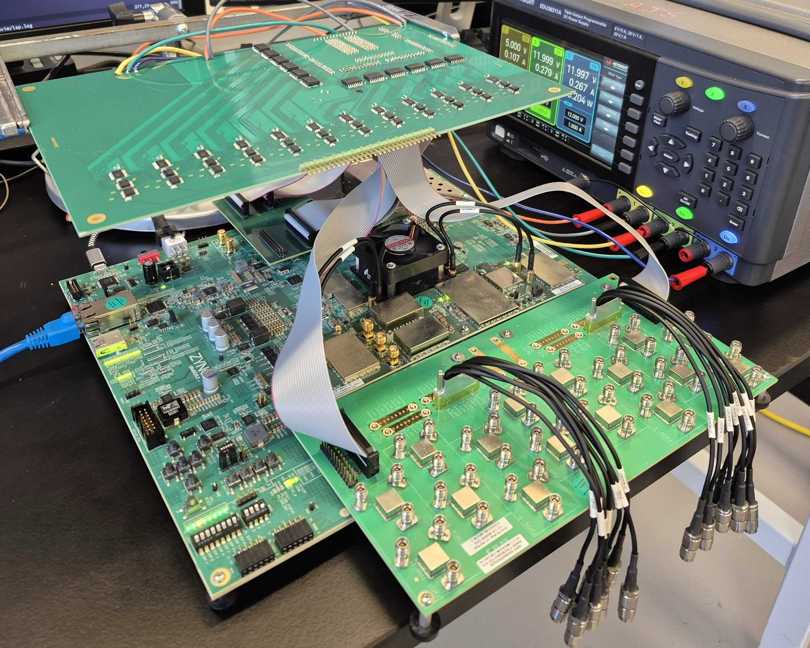
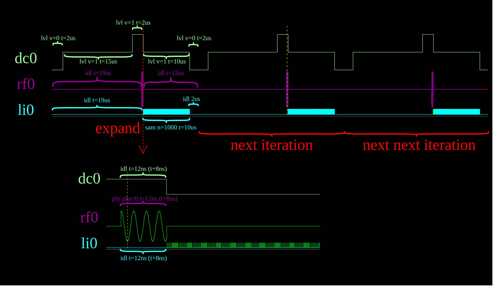

Overview
========
Scriapin (Spin + Control Resource Integration Architecture) is an integrated quantum control platform designed specifically for quantum dot spin qubits. Its goal is to reduce control stack complexity and cost while improving performance and programmability by integrating all the requried control resources onto a single FPGA. With the two custom PCBs (FMC breakout board and bias DAC board), the current configuration has:

* 24x bias DC channels (AD5791BRUZ)
* 6x RF IQ pairs for further analog upconversion
* 2x singled-ended RF channels and 2x ADC channels for lockin-in measurement
* 2x singled-ended fast DC channels

<p align="center">
 
</p>

Each aforementioned signal/measurement channel has its own fully-pipelined control core. Each core/channel can be programmed to iteratively executes a set of custom assembly instructions in which precise timing of the pulses can be specified. See the annotated Rabi example below for a feeling of this execution model.

```text
.program rf0                 # program for RF channel 0
.fnco 10MHz                  # baseband signal is 10MHz
.repeat 100                  # this program repeats 100 times
    idl t=19us (arm)         # idle for 19us
    ply phs=0 t=12ns (t+8ns) # play the baseband signal for 12ns
    idl t=12us               # idle for 12us

.program dc0                 # program for DC channel 0
.repeat 100                  # this program repeats 100 times
    lvl v=0 t=2us (arm)      # output 0V for 2us
    lvl v=1 t=15us           # output 1V for 15us
    lvl v=2 t=2us            # output 2V for 2us
    idl t=12ns (t+8ns)       # idle for 12ns, and increment the duration by 8ns every iteration
    lvl v=1 t=10us           # output 1V for 10us
    lvl v=0 t=2us            # output 0V for 2us

.program li0                 # program for LI (lock-in) channel 0
.repeat 100                  # this program repeats 100 times
    idl t=19us (arm)         # idle for 19us
    idl t=12ns (t+8ns)       # idle for 12ns, and increment the duration by 8ns every iteration
    sam n=1000 t=10us        # sample 1000 samples spanning 10us
    idl t=2us                # idle for 2us

.launch rf0 dc0 li0          # launch RF channel 0, DC channel 0, LI channel 0 
```

<p align="center"> 
  
</p>


## Project Status
The project currently has three parts:
* RTL design, along with testbenches and some formal properties used for verification (under rtl)
* PCB design for the 24 bias DC channels, along with assembly instrctions (under pcb)
* Assembler for compiling and executing the custom assembly programs (under asm)

This project is currently under active development. The RTL design, assembler, and PCB design may continue to evolve as functionality is validated experimentally and the system is further refined. More detailed documentation and user guides will be added as the project matures.
