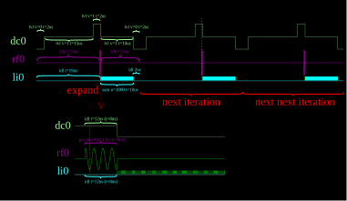

Scriapin (Spin + Control Resource Integration Architecture) is an integrated quantum control platform designed specifically for quantum dot spin qubits. It's goal is to reduce control stack complexity and cost while improving transparency and programmability.

It does so by letting each signal channel have its dedicated control core, allowing channels to run independently in parallel. Each core iteratively executes a small set of custom assembly instructions in which precise timing is specified, allowing them to coordinate with minimal orchestration components. See the annotated Rabi example below for a feeling of this.

<table>
  <tr>
    <td valign="top">
      <pre lang="asm">
.program rf0                 # program for RF channel 0
.fnco 10MHz                  # baseband signal is 10MHz
.repeat 100                  # this program repeats 100 times
    idl t=19us (arm)         # idle for 19us
    ply phs=0 t=12ns (t+8ns) # play the baseband signal for 12ns
    idl t=12us               # idle for 12us 

.program dc0                 # program for DC channel 0
.repeat 100                  # this program repeats 100 times
    lvl v=0 t=2us (arm)      # output 0V for 2us
    lvl v=1 t=15us           # output 1V for 15us
    lvl v=2 t=2us            # output 2V for 2us
    idl t=12ns (t+8ns)       # idle for 12ns, and increment the duration by 8ns every iteration
    lvl v=1 t=10us           # output 1V for 10us
    lvl v=0 t=2us            # output 0V for 2us

.program li0                 # program for LI (lock-in) channel 0
.repeat 100                  # this program repeats 100 times
    idl t=19us (arm)         # idle for 19us
    idl t=12ns (t+8ns)       # idle for 12ns, and increment the duration by 8ns every iteration
    sam n=1000 t=10us        # sample 1000 samples spanning 10us
    idl t=2us                # idle for 2us

.launch rf0 dc0 li0          # launch RF channel 0, DC channel 0, LI channel 0
      </pre>
    </td>
    <td valign="top" align="center">
      
    </td>
  </tr>
</table>

The project has three parts:
* RTL design, along with testbenches and formal properties used for verification (under rtl)
* PCB design for low-noise DC, along with assembly instrctions (under pcb)
* Assembler for compiling and executing Squish programs (under asm)

The project is currently work in progress.

 

